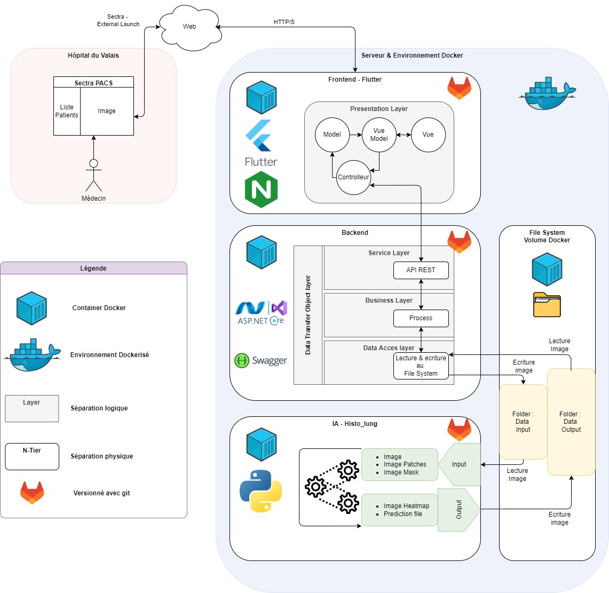

# Sectra Pacs Plugin - Backend

## Introduction

This project is the backend for the **Sectra Pacs Plugin** application, developed with ASP.NET Core. The backend handles the API requests, manages business logic, interacts with the data storage, and communicates with the AI analysis service. This README provides the necessary information to understand, configure, and deploy the backend of the application.

## Project Structure

The backend solution consists of multiple projects, each serving a specific role in the architecture:

1. **API REST**: The main project that handles HTTPS requests and exposes endpoints for the frontend.
2. **BLL (Business Logic Layer)**: Contains the business logic of the application.
3. **DAL (Data Access Layer)**: Handles the interaction with the file system and other data storage mechanisms.
4. **DTO (Data Transfer Objects)**: Defines the data structures that are used to transfer data between the layers.
5. **Docker Compose**: Manages the Docker containers used to deploy the application.

Here's an illustration of how these projects fit into the overall architecture:



## Dependencies and Prerequisites

### Environment Dependencies (Dockerfile)

These dependencies are required for the environment where the application runs, specifically within the Docker container:

- **openssl**: For managing SSL/TLS certificates.
- **apt-transport-https, ca-certificates, curl, gnupg, lsb-release, software-properties-common**: Essential packages for setting up the Docker environment and managing repositories.
- **docker-ce-cli**: The Docker CLI tool to interact with Docker from within the container.

These dependencies are installed via the `Dockerfile` during the build process of the Docker image.

### Application Dependencies (NuGet Packages)

These dependencies are used directly in the application code and are managed by NuGet, which is the package manager for .NET:

- **Swashbuckle.AspNetCore**: For generating Swagger documentation, which provides an interactive API documentation interface.
- **Docker.DotNet**: To allow the application to interact with Docker through the .NET API, enabling Docker commands and operations from within the .NET code.
- **SkiaSharp.NativeAssets.Linux**: A cross-platform 2D graphics library that is used for image processing on Linux.
- **System.Drawing.Common**: Provides access to GDI+ graphics functionality, used for image manipulation.

These packages are specified in the `.csproj` files of the respective projects (API REST, BLL, DAL, DTO) and are automatically restored and managed by NuGet when you build the project.


## How to Deploy

To deploy the backend on your server, follow these steps:

### 1. Clone the Repository on the Server

If this is the first time deploying, or if you need to pull the latest changes:

```bash
git clone <repository-url>
cd <repository-folder>
```

### 2. Build and Run the Application

Use the provided scripts to build and run the Docker containers:

- **Build the Docker image**:
  ```bash
  ./build-docker-image.sh
  ```

- **Run Docker Compose**:
  ```bash
  ./run-docker-compose-AI-BACKEND.sh
  ```

### 3. Automate Deployment (Optional)

For automated deployment, use the following script which will:

1. Pull the latest updates from the Git repository.
2. Rebuild the Docker image.
3. Restart the Docker Compose services.

```bash
./automate-deployment.sh
```

### 4. Access the API

After deployment, the API will be available at:

```bash
https://localhost:8087/swagger
```

## Additional Documentation

For more details on ASP.NET Core development, refer to the [official documentation](https://docs.microsoft.com/en-us/aspnet/core/).

